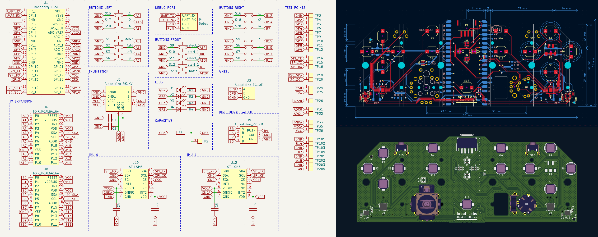

# Alpakka PCB

*Alpakka controller Printed Circuit Board reference design*

## Project links
- [Alpakka Manual](https://inputlabs.io/devices/alpakka/manual).
- [Alpakka Firmware](https://github.com/inputlabs/alpakka_firmware).
- [Alpakka PCB](https://github.com/inputlabs/alpakka_pcb). _(you are here)_
- [Alpakka 3D-print](https://github.com/inputlabs/alpakka_case).

## Previews

## Order a PCB from the reference design
For ordering a reference design PCB (with no modifications) is possible to use the pre-built [order files](https://github.com/inputlabs/alpakka_pcb/releases). Check the [manual](https://inputlabs.io/devices/alpakka/manual/diy_pcb) for step-by-step instructions.

## Modify the schematics and PCB

### Dependencies
- [KiCad 6](https://www.kicad.org)

### Change components for SMT pick & place

- Open `.kicad_sch` file in Schematics editor.
- Go to menu `Tools` → `Edit symbol fields`
- Group by field `Group`
- Change id references (`LCSC id` for [JLCPCB](https://jlcpcb.com)).

### Generate order files from sources
- Copy `plugins/kicad_ilo_export.py` into KiCad plugins folder (PCB editor → menu `Tools` → `External plugins` → `Reveal plugins folder`).
- Open `.kicad_pcb` file in PCB editor.
- Use menu `Edit` → `Fill all zones`
- Go to menu `Tools` → `External plugins` → `Refresh plugins`
- Go to menu `Tools` → `External plugins` → `Input Labs: export`
- Note that there won't be any message when the export is completed (unless there is an error).
- Files are generated into `order/`

### If the plugin does not load correctly
- Open `Preferences` → `Action plugins`
- Check that the plugin is installed correctly / check errors.

### Procedural zones
Consolidated zones increase `.kicad_pcb` file size significantly, so instead is recommended to load and save the project without consolidation:

- After loading the PCB project: `Edit` → `Fill all zones`.
- Before saving the PCB project: `Edit` → `Unfill all zones`.
